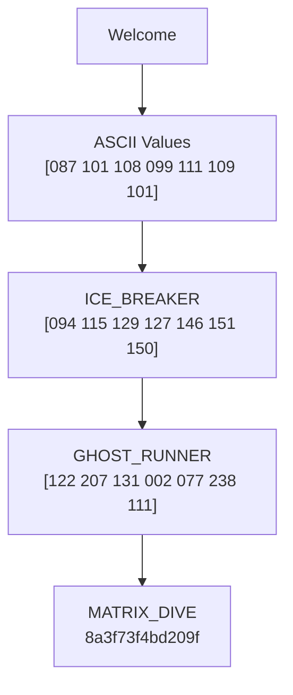

# The Netrunner Cipher: Encryption Analysis
> Detailed breakdown of the encryption process using the word "Welcome" as an example

## Table of Contents
- [Understanding ASCII Encoding](#understanding-ascii-encoding)
- [Encryption Layers](#encryption-layers)
  - [Layer 1: ICE_BREAKER](#layer-1-ice_breaker)
  - [Layer 2: GHOST_RUNNER](#layer-2-ghost_runner)
  - [Layer 3: MATRIX_DIVE](#layer-3-matrix_dive)
- [Complete Transformation Process](#complete-transformation-process)
- [Technical Details](#technical-details)

## Understanding ASCII Encoding
Before encryption begins, text is converted to ASCII numbers. Here's how "Welcome" is represented:

| Character | ASCII | Binary    |
|-----------|-------|-----------|
| W         | 087   | 01010111  |
| e         | 101   | 01100101  |
| l         | 108   | 01101100  |
| c         | 099   | 01100011  |
| o         | 111   | 01101111  |
| m         | 109   | 01101101  |
| e         | 101   | 01100101  |

## Encryption Layers

### Layer 1: ICE_BREAKER
This layer performs initial text scrambling using position-based shifts.

#### Shift Calculation
- Text length: 7 characters
- Base shift: 7 (calculated as length % 26)

#### Transformation Process
Formula: `(ASCII value + shift + (position × shift)) % 255`

Example for first two letters:
```
'W' (Position 0):
- Initial: 087
- Add shift (7): 087 + 7 = 094
- Position effect (0 × 7): 094 + 0 = 094
Final: 094

'e' (Position 1):
- Initial: 101
- Add shift (7): 101 + 7 = 108
- Position effect (1 × 7): 108 + 7 = 115
Final: 115
```

**Result:** [094 115 129 127 146 151 150]

### Layer 2: GHOST_RUNNER
This layer performs binary manipulation on the numbers.

#### Bit Manipulation Process
Each number goes through these steps:
1. Convert to 8-bit binary
2. Reverse the bits
3. Add position number
4. Keep within range (% 255)

Example with first number:
```
094 (01011110)
↓
Reverse bits (01111010) = 122
↓
Position 0 (no addition)
↓
Final: 122
```

**Complete Transformation:**
```
094 → 122
115 → 207
129 → 131
127 → 002
146 → 077
151 → 238
150 → 111
```

### Layer 3: MATRIX_DIVE
Final layer using XOR operations and masking.

#### About Masking
- Uses CYBER_MASK: 0xF0 (11110000 in binary)
- Affects first 4 bits of each number

#### XOR Operation
Comparison rules:
- Different bits → 1
- Same bits → 0

Example:
```
Number:   10110101
Mask:     11110000
Result:   01000101
```

#### Final Processing
1. XOR with (CYBER_MASK + position)
2. Add position number
3. Convert to hexadecimal

**Final Result:** 8a3f73f4bd209f

## Complete Transformation Process


## Technical Details

### Encryption Properties
- Signal Strength: 7 (input length)
- Entropy Level: 12% (randomness measure)
- Reversible process
- Deterministic output

### Key Features
1. Consistent output for same input
2. High sensitivity to input changes
3. Full reversibility

### Layer Significance
1. **ICE_BREAKER**: Initial text scrambling
2. **GHOST_RUNNER**: Pattern obfuscation
3. **MATRIX_DIVE**: Final complexity layer

---
*Note: This documentation describes the encryption process of The Netrunner Cipher system using "Welcome" as an example case.*
